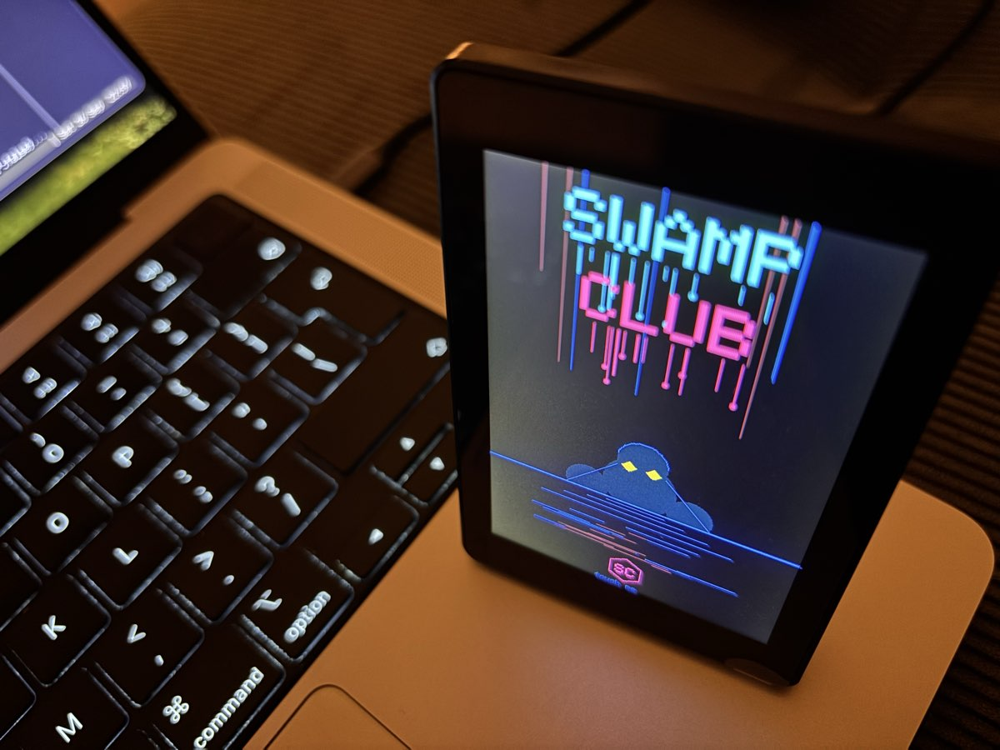

# @vcjdeboer/s3-panel

Drive an ESP32-S3 **with a screen** from [swamp](https://github.com/swamp-club/swamp).
Built for the **Guition JC3248W535** (also sold under the diymore brand): an
ESP32-S3 N16R8 with a 3.5" 320x480 capacitive touch display. See
[Hardware](#hardware) for the pin map, and [`firmware/s3panel`](firmware/s3panel/s3panel.ino)
for the firmware that runs on it.



One model type, `@vcjdeboer/s3-panel`. It is everything
[`@vcjdeboer/s3-device`](https://github.com/vcjdeboer/esp32-s3) does — `detect`,
`ping`, `status`, `send`, `write`, `read`, `hold`, `release` — plus typed methods
for the display: `text`, `fill`, `clear`, `backlight` and `logo`.

The board renders and the host says what to render. No pixels cross the wire,
which is what makes a 320x480 panel usable over a serial link at all.

## Hardware

Built and verified on the **Guition JC3248W535** (also sold under the
diymore brand):

| Part | Detail |
| --- | --- |
| MCU | ESP32-S3 **N16R8**: 16 MB flash, 8 MB octal PSRAM |
| Display | 3.5", 320x480, **AXS15231B** controller on a 4-bit QSPI bus |
| Touch | Capacitive, built into the same AXS15231B, read over I2C at `0x3B` |
| Host link | Native USB (USB-CDC), 115200 baud; no USB-UART bridge chip |

Pin map (fixed on the board):

| Function | GPIO |
| --- | --- |
| QSPI CS / SCK | 45 / 47 |
| QSPI D0 / D1 / D2 / D3 | 21 / 48 / 40 / 39 |
| Backlight | 1 |
| Touch SDA / SCL | 4 / 8 |
| Touch INT / RST | 11 / 12 (I2C at 400 kHz) |

Things that bite on this board:

- **Initialise the display before touch.** The AXS15231B is one chip for both;
  its QSPI init sequence also configures the touch side. Touch first and the
  I2C address still ACKs, but every read comes back as zeros.
- **Use the `320480_type1` init sequence.** Arduino_GFX 1.6.x defaults to
  `axs15231b_180640_init_operations`, which is for a different panel. The
  firmware selects `axs15231b_320480_type1_init_operations`
  (`-DPANEL_INIT_TYPE=2` switches to `type2` if a board revision needs it).
- **The full-screen canvas needs PSRAM.** 320x480 at 16 bpp does not fit in
  internal RAM, so build with `PSRAM=opi`.

### Firmware

The firmware is in this repo: [`firmware/s3panel/s3panel.ino`](firmware/s3panel/s3panel.ino)
(`s3panel 0.10`; `ping` reports the version). It implements every command in
the [firmware contract](#firmware-contract), plus touch, tap events and the logo.

It needs `arduino-cli` with the ESP32 Arduino core `esp32:esp32@3.3.12` and the
libraries **GFX Library for Arduino 1.6.8** and **ArduinoJson**:

```bash
arduino-cli core install esp32:esp32@3.3.12 \
  --additional-urls https://espressif.github.io/arduino-esp32/package_esp32_index.json
arduino-cli lib install "GFX Library for Arduino@1.6.8" ArduinoJson
```

Clone this repo and flash the sketch through the model, which compiles,
uploads, releases and re-takes the port, and records the build output:

```bash
git clone https://github.com/vcjdeboer/s3-panel
swamp model method run panel flash --input sketchPath=s3-panel/firmware/s3panel
swamp model method run panel ping    # {"ok":true,"fw":"s3panel 0.10"}
```

The model's
`fqbn` global argument defaults to
`esp32:esp32:esp32s3:CDCOnBoot=cdc,PSRAM=opi,FlashSize=16M,PartitionScheme=app3M_fat9M_16MB`;
override it only for another board variant. All four options matter: `CDCOnBoot=cdc` puts the serial console on the
native USB port this extension talks to. Arduino_GFX 1.5.x does not compile
against core 3.3.x, and 1.6.x renamed the colour constants to `RGB565_*`.

## Agent skill

The extension ships a skill, `driving-s3-panel`, that `swamp extension pull`
installs into `.claude/skills/`. It gives coding agents the operational
knowledge the method tables don't: finding the port after a replug, who owns
the port (the holder), the per-model lock, the panel ignoring serial while it
waits for a tap, answering `manual_approval` steps from the panel, flashing, and
changing and publishing the extension.

## Why not just use `send`

The screen commands are reachable from the plain `s3-device` type through its
generic `send`. What this type adds is a typed surface:

- **A colour must be one the firmware knows.** `fill --input color=purple` is
  refused by argument validation before the board is touched.
- **Lines are validated, then joined for you.** Pass an array of strings; the
  wire format's separator is applied internally. Text containing that separator,
  or a newline, is rejected up front instead of silently becoming extra lines or
  extra commands.
- **Records are shaped like drawing operations**, with the operation named, so
  `draw-latest` reads as a display history rather than an opaque exchange log.

## Install

```bash
swamp extension pull @vcjdeboer/s3-panel
swamp model create @vcjdeboer/s3-panel panel
```

Set `holder: true` and pin `device` if more than one board is attached. All
global arguments are the same as `s3-device`; see its README.

**The port name is not stable.** macOS names the node after the physical USB
socket (`/dev/cu.usbmodem1101`, `/dev/cu.usbmodem2101`, …), and on Linux it is
`/dev/ttyACM*` in plug-in order. After replugging, run
`swamp model method run panel detect` and update the pinned `device` if it
moved; a stale value either fails to open or talks to a different board.

## Screen methods

| Method | Arguments | Notes |
| --- | --- | --- |
| `text` | `lines` (array of strings) | Replaces the screen. First 12 lines drawn, each truncated to the panel width. |
| `fill` | `color` | One of black, white, red, green, blue, yellow, cyan, magenta. |
| `clear` | none | Blanks to black, leaves the backlight alone. |
| `backlight` | `on` (boolean) | Off keeps the framebuffer, so a dark panel is not evidence that drawing failed. |
| `logo` | none | Show the Swamp Club logo. Touch the screen to trigger an explosion; the logo redraws after. |

Each writes a `draw-latest` record carrying the command sent, the board's reply,
`outcome`, `observedAt` and `elapsedMs`.

## Touch screens and approvals

| Method | Arguments | Notes |
| --- | --- | --- |
| `screen` | `elements` (array), `timeoutMs` | Pushes a layout: `label`, `button` (with an `id`, which makes it a touch zone) and `gap` elements, stacked below a mini logo. Writes `screen-latest`. |
| `zonewait` | `waitMs` (default 12 h) | Blocks until a button is tapped and writes `zone-latest` with its `id`, or a timeout. |
| `approve` | `workflow`, `step`, optional `prompt`, `run`, `resolve`, `resume`, `waitMs` | Answers a suspended `manual_approval` step from the panel, end to end. See below. |

### Approving a workflow step from the panel

swamp's `manual_approval` step suspends a run until someone approves or rejects
it. `approve` lets that someone be a finger on the panel:

1. It looks up the suspended run with `swamp workflow approvals`. Nothing is
   drawn if no run of `workflow` waits at `step`, and it refuses to guess when
   several do: pass `run=<id>` to pick one.
2. It shows the workflow, the step, the step's own prompt (or `prompt`) and
   APPROVE / REJECT, and waits for a tap (`waitMs`, default 12 h).
3. It hands the tap to swamp exactly as given: `swamp workflow approve` or
   `swamp workflow reject` for that run, with `--run` and a reason naming the
   panel. A reject ends the run as failed.
4. After an approve it starts `swamp workflow resume` for the run, detached and
   last, so resumed steps that use this same panel are not kept waiting.

A timeout, a lost serial link or a stray tap resolves nothing: the run stays
suspended. If swamp refuses the decision the method fails and says so.

Verified end to end on a JC3248W535: a REJECT tap failed the waiting run with
the panel reason, and an APPROVE tap approved it and the detached resume
carried the run on to a later step that used the same panel.

```bash
swamp workflow run deploy                   # suspends at the approve-deploy step
swamp model method run panel approve \
  --input workflow=deploy --input step=approve-deploy
swamp data get panel approval-latest --json
```

`approval-latest` is an evidentiary record of the tap: `workflow`, `step`,
`runId`, `prompt`, `decision` (`approved`, `rejected`, `timeout`, `no-reply`),
`source: panel`, `resolved`, `resolveError`, `resumed` and `decidedAt`. swamp
keeps a reason only for rejections, so this record is where an approval's
origin is written down.

`resolve=false` only records the tap and leaves the run to you;
`resume=false` approves without resuming. The method calls back into the swamp
binary it runs under, in the same repository; `swampPath` overrides the binary.
It blocks until a tap, so start it in the background from a script or agent.

## Use

```bash
swamp model method run panel hold
swamp model method run panel text --input 'lines=["S3 PANEL","ready"]'
swamp model method run panel fill --input color=green
swamp model method run panel clear
swamp model method run panel release
```

Release the holder before flashing the board: a held port blocks the upload.

## Firmware contract

Answer one JSON object per command line. The commands this type sends:

| Sent | Expected reply |
| --- | --- |
| `text a\|b\|c` | `{"ok":true,"lines":3}` |
| `fill red` | `{"ok":true,"color":"red"}` |
| `clear` | `{"ok":true}` |
| `backlight on` | `{"ok":true,"backlight":true}` |
| `logo` | `{"ok":true}` |
| `screen clear` | `{"ok":true}` |
| `screen add {"type":"button","id":"approve","text":"APPROVE"}` | `{"ok":true,"index":6}` |
| `screen show` | `{"ok":true,"elements":7,"zones":2}` |
| `screen wait 60000` | `{"ok":true,"id":"approve","x":160,"y":400}` on a tap, `{"ok":true,"timeout":true}` otherwise |

A reply with `"ok":false` is recorded as `outcome=error` and then thrown, with
the board's own `error` string in the message.

The reference firmware, [`firmware/s3panel`](firmware/s3panel/s3panel.ino), is
written for the JC3248W535 (see [Hardware](#hardware)); any firmware answering
the commands above will do.

## Relationship to `@vcjdeboer/esp32-s3`

swamp resolves extension dependencies only for workflows, so a model type cannot
import another extension's code at runtime. The shared base therefore lives in
`extensions/models/_lib/s3_base.ts`, vendored byte-identically in both
extensions — the same arrangement the serial transport already has. Runtime
composition belongs in workflows, which can span both types.

## Licence

MIT.
